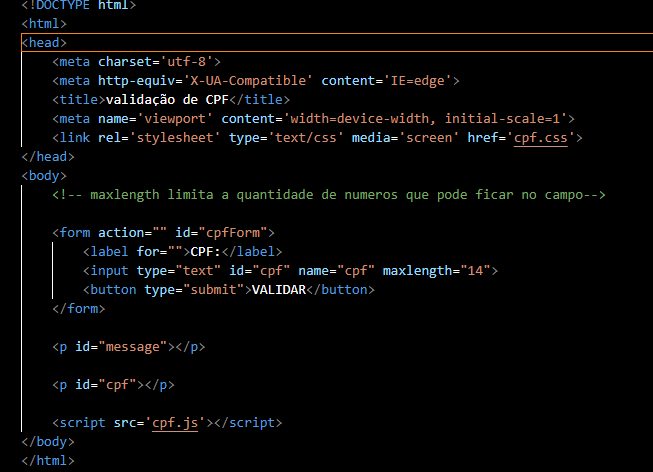
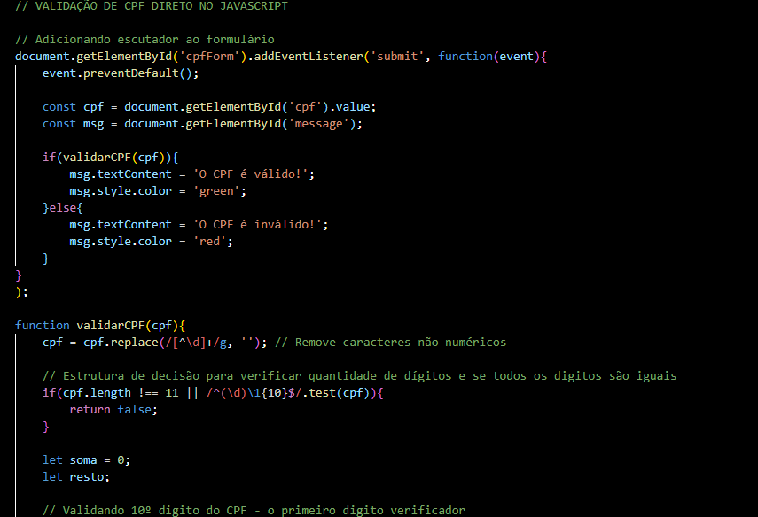
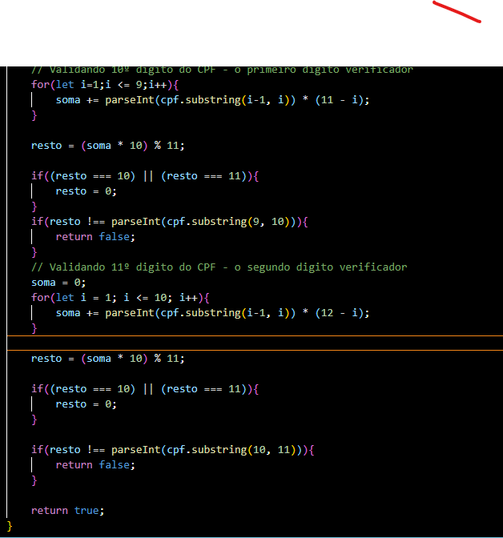
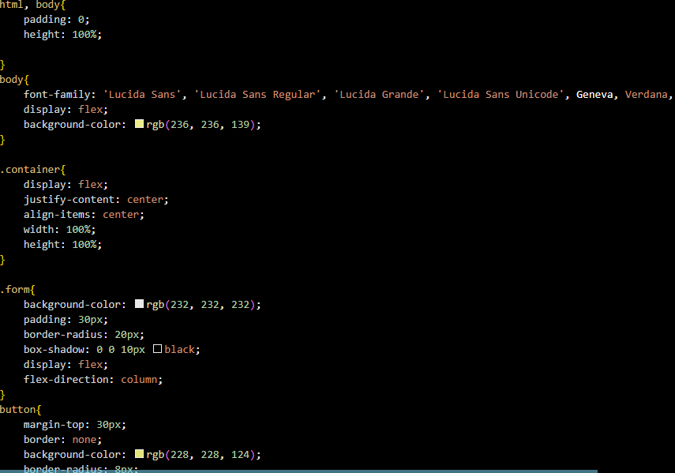
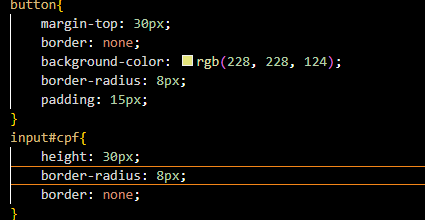
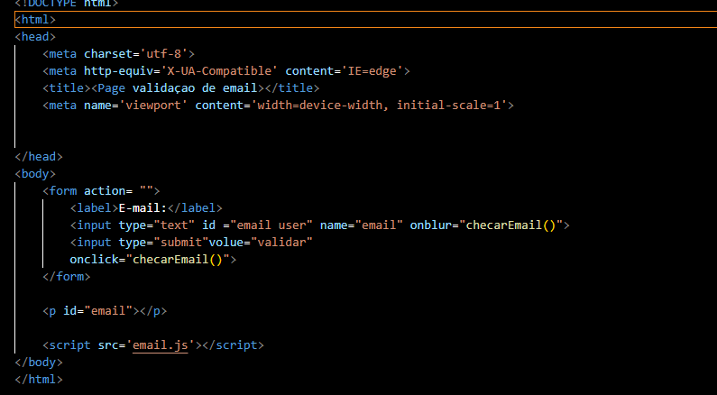
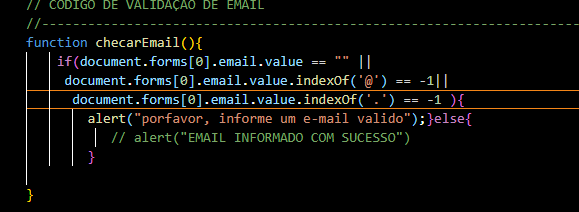

# Projetos com Validações

## VALIDAÇÃO DE CPF

códigos:
 
 - HTML:  
 

 - JS:  
 

 

 - CSS:  
 

 

### explicação js
   
   Esse código foi estruturado para a validação de cpf, dizendo se o cpf é válido ou não. O laço de iteração "for" foi usado para a soma dos números. Também foi usado "if else" para essa validação.

## VALIDAÇÃO DE EMAIL

códigos:

 - HTML:  
 

 - JS:  
 

### explicação js

 Foi estruturado para a validação do email. Se o email informado conter '@' e '.com', o email é válido e aparece uma mensagem "alert" com "email informado com sucesso", caso contrário, um "alert" aparece com a mensagem "por favor, informe um email válido".
